# 2D Cylinder Vortex Shedding

This is an OpenFOAM simulation for airflow over a 2 dimensional cylinder under various Reynolds numbers with steady state or transient behaviours. Below you can find results for each flow regime, a grid and time dependence study, and other notes about various experiments.


[OpenFOAM Version 11](https://openfoam.org/version/11/) was used.

[Octave](https://octave.org/) is also used for some data processing.

## Scenario Overview
The simulated domain is 65 m long and 30 m wide, with the cylinder 15 m from the front and along the centerline.

**Simulation Properties:**
* Medium: Air
* Flow Model: Incompressible
* Solver: PIMPLE
* Mesh Cells: 110k
* Reynolds Numbers: 2, 20, 200, 3e3

**Boundary Conditions:**

| Parameter | Inlet | Outlet | Walls | Cylinder |
|-|-|-|-|-|
| Pressure | Zero Gradient | 0 [Pa] | Symmetry | Zero Gradient |
| Velocity | 1.0 m/s | Zero Gradient | Symmetry | No Slip |
| k | Fixed | Zero Gradient | Symmetry | kqRWallFunction |
| omega | Fixed | Zero Gradient | Symmetry | omegaWallFunction |
| nut | Calculated | Calculated | Symmetry | nutUSpaldingWallFunction |

A freestream velocity of 1.0 m/s was used across all scenarios while kinematic viscosity was varied to achieve target Reynolds numbers.

**Mesh:**  
* Cells: 110k
* Background cell size: 0.5 m
* Refinement levels: 5
* Surface layers: 5
* Smallest cell size: 0.015625 m (assuming a square cell)

The hexahedral mesh was generated with `snappyHexMesh` using a background mesh generated with `blockMesh` and an STL file of the cylinder (under `constant/geometry`). The resulting 3D mesh was then extruded to 2D using the `extrudeMesh` utility.

Several refinement regions were added around and behind the cylinder, with each refinement region getting progressively wide and more coarse with increasing distance from the cylinder.

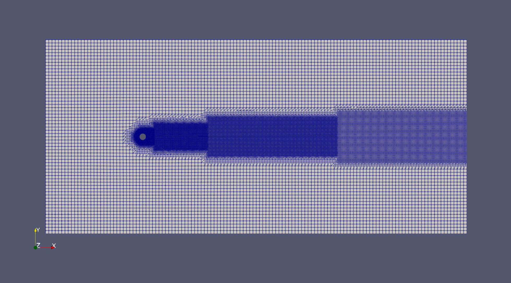

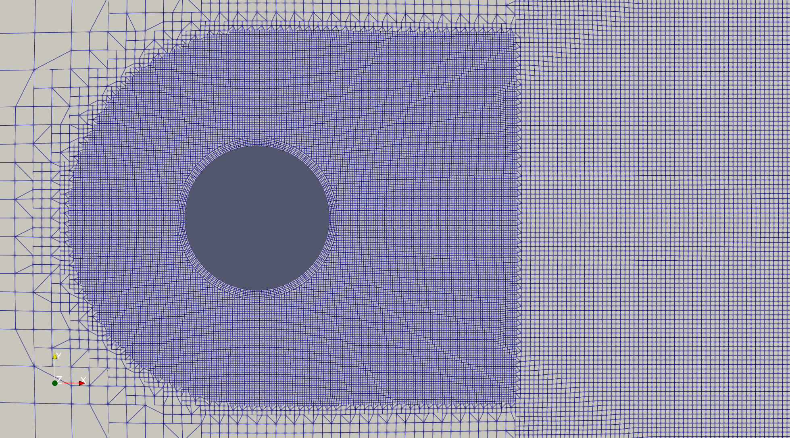

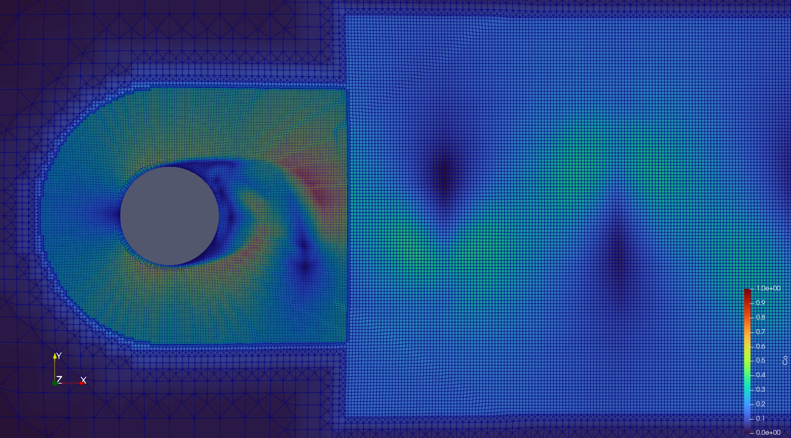

The final image shows the Courant number in each cell from an Re=3e3 simulation.

See the [Grid and Time Step Dependence](#Grid-and-Time-Step-Dependence) section for an analysis on grid sizing.

## Results

### Re=2
* Flow: Laminar, steady state
* Time Step: 1
* Duration: 1.5e4
* Cd: 7.4850

At Re=2 the flow is creeping and has no separation around the cylinder.

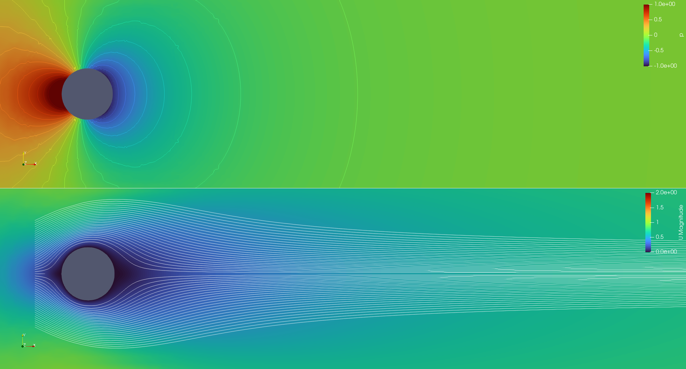

### Re=20
* Flow: Laminar, steady state
* Time Step: 1
* Duration: 1.5e4
* Cd: 2.1015

At Re=20 there begins to be some separation around the trailing half of the cylinder producing two circulation zones directly behind the cylinder. The flow is still symmetrical and non-oscillatory.

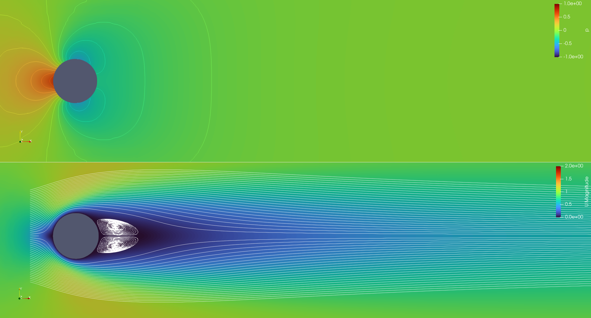

### Re=200
* Flow: Laminar, transient
* Time Step: 0.005 s
* Duration: 60.0 s
* Cd: 1.3565 +/- 0.0465 (min=1.3099, max=1.4030)
* Cl: 0.0000 +/- 0.6973 (min=-0.6973, max=0.6972)

At Re=200 the flow become oscillatory. The pressure distribution on each side of the cylinder is no longer symmetric, and instead the lowest pressure zone and separation points shift from side to side creating series of trailing vortices known as a vortex street.

Initially the flow will look similar to the Re=20 case (i.e. steady state), but eventually some perturbation will unsettle the flow inducing this oscillatory pattern which will eventually setting on a steady-state sinusoidal pattern. This simulation artifically induces the instability via some initial conditions to make oscillations appear more quickly. See the [Inducing Instability](#Inducing-Instability) section for more details.

The resulting drag and lift coefficients are in close agreement with the values from *Section 9.12.2* of [1]. Although [1] doesn't quote exact values, the plots indicate Cd values in the range [1.302, 1.398] and Cl values in the range [-0.70, 0.70].

The results quoted here are for an *medium* mesh and time step size (see the [Grid and Time Step Dependence](#Grid-and-Time-Step-Dependence) section for grid data)

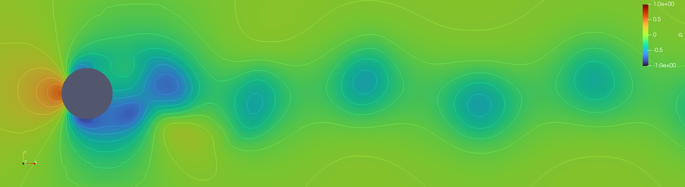

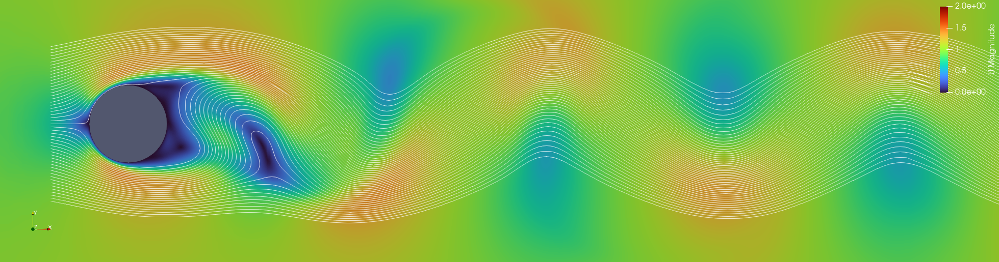

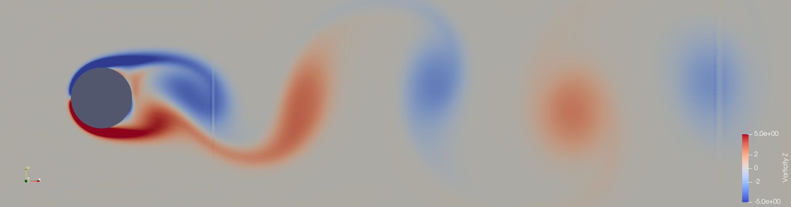

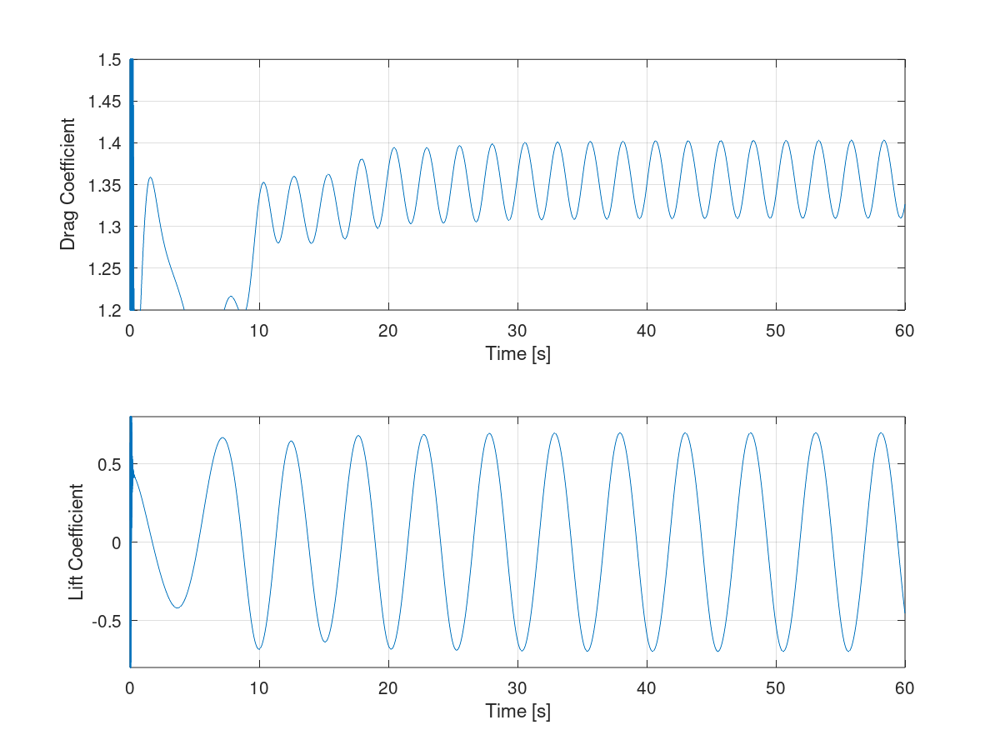

### Re=3e3
* Flow: Turbulent, transient
* Time Step: 0.005 s
* Duration: 60.0 s
* Cd: 1.6464 +/- 0.2430 (min=1.4035, max=1.8894)
* Cl: 0.0048 +/- 1.5818 (min=-1.5770, max=1.5866)

At Re=3e3 the flow behaves similarly to the Re=200 case except the flow is fully turbulent.


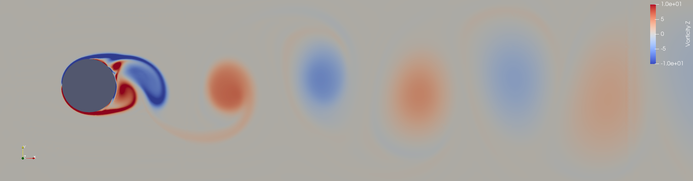

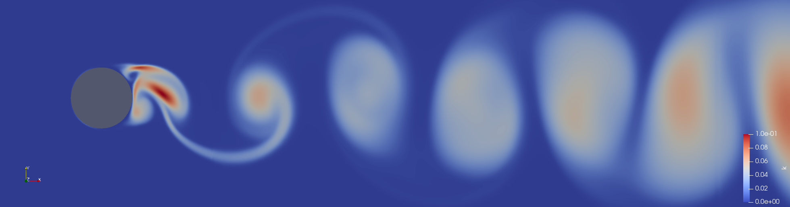

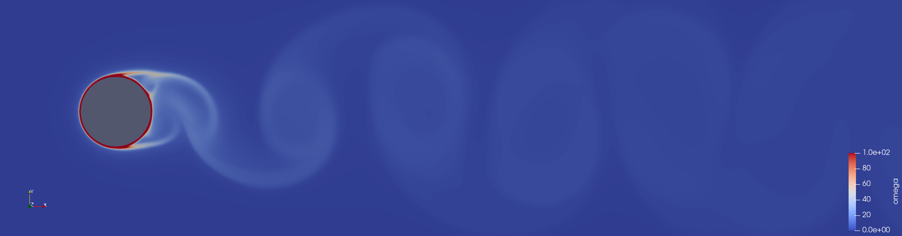

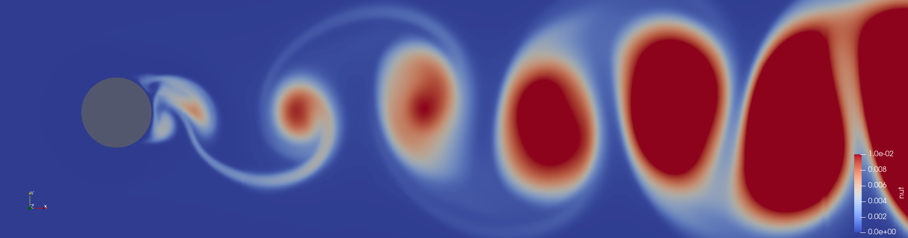

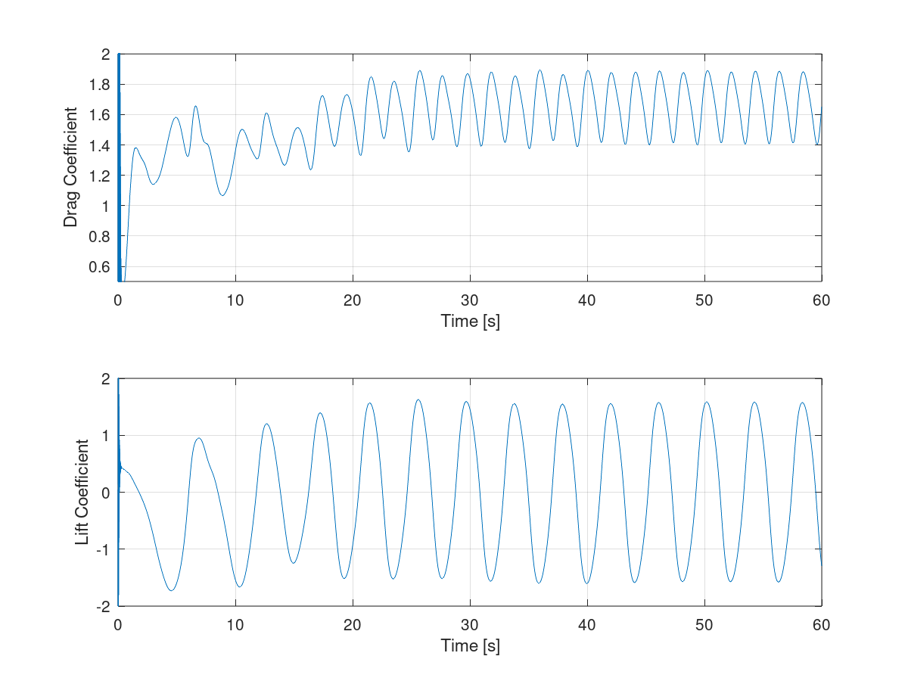

## Running The Simulation
There are a set of scripts under the `scripts` directory for running everything. All scripts accept a `-c` option to clear existing data as well as a `-j <CORES>` option for parallelization. Run any script with the `-h` option for usage.

The following examples assume parallel processing with 12 cores for a high Re flow with oscillations.

To mesh:
```bash
./scripts/mesh.sh -j 12
```

To solve:
```bash
./scripts/solve.sh -s -j 12
```
The `-s` option indicates to run the `setFields` operation which will perturb the velocity field to induce instability in oscillatory flows more quickly. Remove if not desired.

To perform meshing and solving in one command:
```bash
./scripts/run_all.sh -s -j 12
```

Everything is currently configured to be parallelized with 12 threads. To alter the number of threads updated `system/decomposeParDict` and call the above scripts with the matching `-j` option. Or, the simulation can be run single threaded by removing the `-j` option from all commands.

### Initial Conditions
The simulation is configured to easily switch between flow regimes by altering the `initialConditions` file under the `include` directory. This file defines all initial conditions and is included everywhere those properties are needed.

The main entries to vary are:
```
// Configuration parameters
Re 3e3;
transient true;
turbulence true;

// Turbulence intensity and viscosity ratio
Tu 0.01;
TVR 0.20;

// Time step and write
dt 0.005;
dt_first_write 60.0;
dt_write 0.20;
dt_force_write $dt;
t_end 60.0;
```

The `transient` flag will control settings in the `fvSchemes` and `fvSolution` files to switch between transient and steady state solutions. For Re > ~40 `transient` must be set to `true`, lower Re can use either but steady state will converge more quickly.

The remaining settings control simulation time and are used within `controlDict`.

### ParaView Configuration
There is a ParaView configuration present that has various visulations setup. To use it start ParaView with `paraFoam -empty` then select `File-->Load State` and direct it to the appropriate folder.

This state file can be used with either decomposed cases or reconstructed cases. Select the appropriate type in the `Properties` pane of the top pipeline element.

There is also a filter present to compute vorticity from the velocity data that is turned off by default.

### Analysis Scripts
There are also additional scripts for analyzing results.

To view a live plot of force coefficients (similar to `pyFoamPlotWatcher.py`):
```bash
octave scripts/plot_force_coeffs.m postProcessing/forces/0/forceCoeffs.dat -Cd 1.1 1.5 -Cl -0.8 0.8
```
The `-Cd` and `-Cl` options specify axis limits.

To evaluate the minimum, maximum, and mean force coefficient values from a `forceCoeffs.dat` file:
```bash
octave scripts/analyze_force_coeffs.m postProcessing/forces/0/forceCoeffs.dat -t 10.0 30.0
```
This will only consider data between 10.0 s and 30.0 s. The results will look like:
```
Force Coefficient Results:
    Cd=1.3511 +/-0.0481 (min=1.3030, max=1.3993)
    Cl=0.0005 +/-0.7078 (min=-0.7072, max=0.7083)
```

To save a batch of results (no data) starting from time point `t=0` (no mesh or field data):
```bash
./scripts/save_results.sh my_experiment 0
```
This will copy plots and log data to a new folder under the `results` directory. Use the `-h` option to see more usage information.

To save all the data and initial conditions for simulation run:
```bash
./scripts/save_data.sh my_experiment
```

## Additional Details

### Grid and Time Step Dependence
Grid and time dependence was analyzed for the Re=3e3 case, the results of which are below.

The mesh was altered by changing the maximum number of refinement levels. The background mesh cell size was kept at 0.50 m. Cell sizes quoted here refer to the size after refining the background mesh. Four mesh sizes were considered:
* Extra Coarse: dx=0.0625, 13k cells
* Coarse: dx=0.0625, 33k cells
* Medium: dx=0.03125, 110k cells
* Fine: dx=0.015625, 414k cells

For each mesh size the simulation was run for 60.0 seconds. The time step size was adjust to keep the Courant number constant relative to the medium mesh with a time step size of 0.005 seconds (e.g. for the Coarse mesh the step size was 0.010 seconds).

For the time dependence study the medium mesh size was used with varying time step sizes of 4x, 2x, 0.5x, and 0.25x. The simulation process was:
1. Mesh at desired cell size
1. Simulate at the nominal time step (0.005) for 60 seconds
1. Scale the time step, simulate for an additional 20 seconds
1. Evaluate the final 5.0 seconds for force coefficient data
1. Repeat steps 1-4 for all desired time step sizes

The plot below shows the change in the drag coefficient mean value and amplitude and the lift coefficient amplitude for all mesh and time step combinations.

Key Takeaways:
* The medium mesh with a time step of 0.005 seconds provides a reasonable compromise between accuracy and computational demand.
* Force coefficients appear to vary in an approximately quadratic fashion with respect to mesh size and time. Although for some settings there is some overshoot.
* The range of mesh sizes and time step sizes considered seems appropriate, it clearly indicates a convergence towards some final value while the magnitude of difference between configuations is large enough that one can make decisions on how to balance computational cost vs. accuracy (coefficient changes of 0.5 between configurations is not helpful, neither are changes of 1e-5).

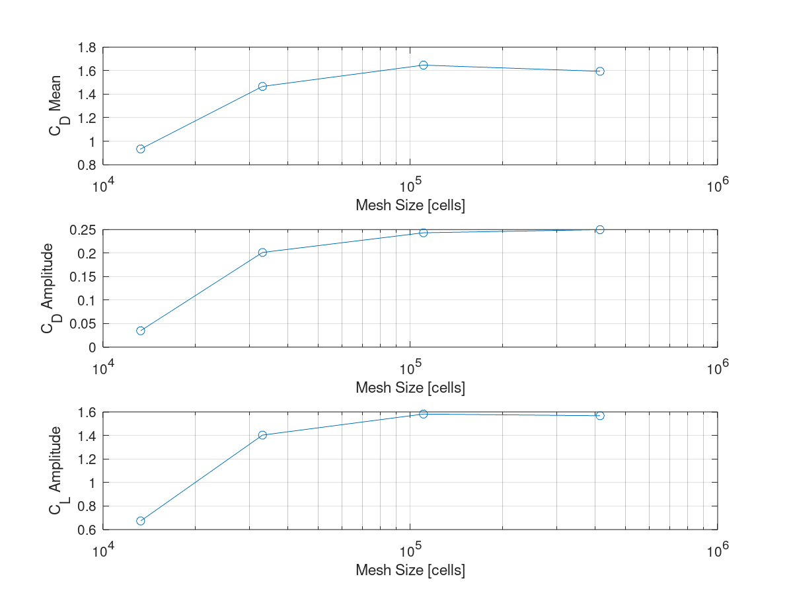

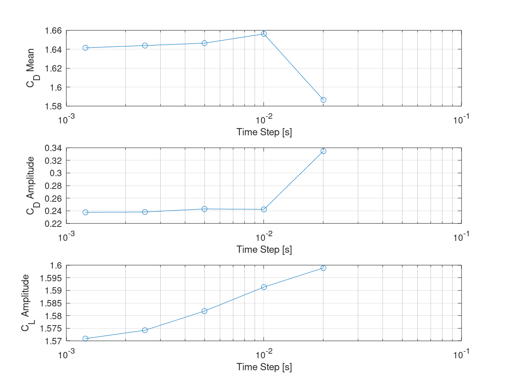

### Inducing Instability
When the domain is initialized with a uniform velocity field the flow will eventually become oscillatory, but it can take a while for this to occur.

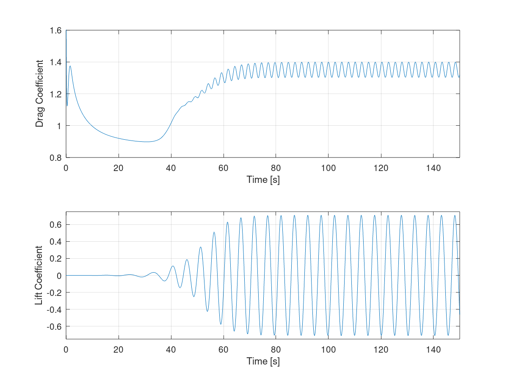

To induce instability more quickly the velocity field in a 2 m wide strip upstream of the cylinder has a 10 degree rotation applied to it. The result is the flow reaches steady-state oscillations in 1/3 the amount of time.

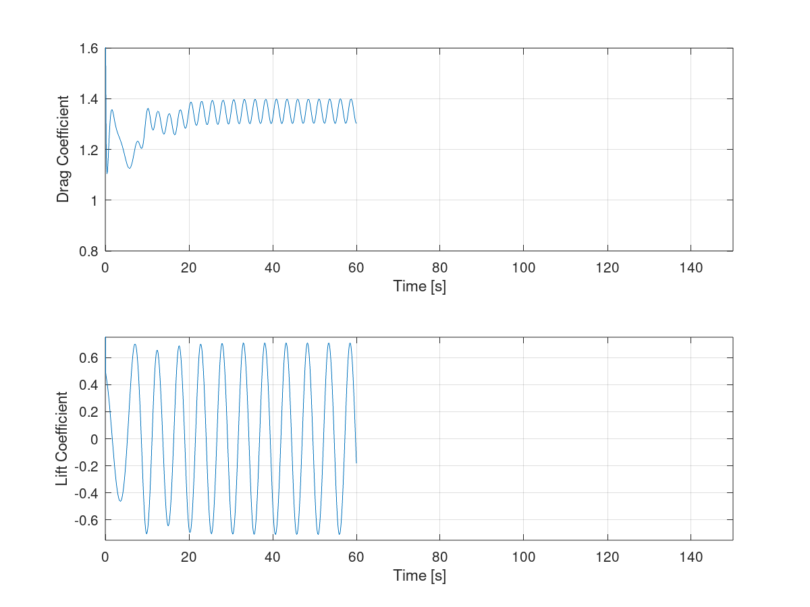

Alternate perturbations were experimented with, but a 10 degree upstream rotation was found to reach steady-state oscillations the quickest. Upstream rotations of 5 and 20 degrees behaved similarly, both taking ~2 seconds longer to reach steady-state than the 10 degree version. A downstream rotation of 5 degrees was also tested and peformed worse than all upstream variations taking ~8 seconds longer.

### Compute
An AMD Ryzen9 3900X CPU (12 cores, 3.8 GHz) was used for all computations. The simulation was parallelized with the domain decomposed into 12 partitions.

Measured computation times for various configurations using the Re=200 case with a time step size of 0.005 s, a duration of 60.0 s, and a single write of data at the end.

| Mesh | Min Cell Size [m] | Cells | Mesh Time [s] | Simulation Time [s] |
|-|-|-|-|-|
| Extra Coarse | 0.0625 | 13k | 4.1 | 89.0 |
| Coarse | 0.03125 | 33k | 9.3 | 150.6 |
| Medium | 0.015625 | 110k | 71.8 | 740.8 |
| Fine | 0.007813 | 414k | 673.1 | 7,853.6 |

## References
[1] *Computational Methods for Fluid Dynamics (Fourth Edition)* - J. Ferziger, M. Peric, R. Street.
