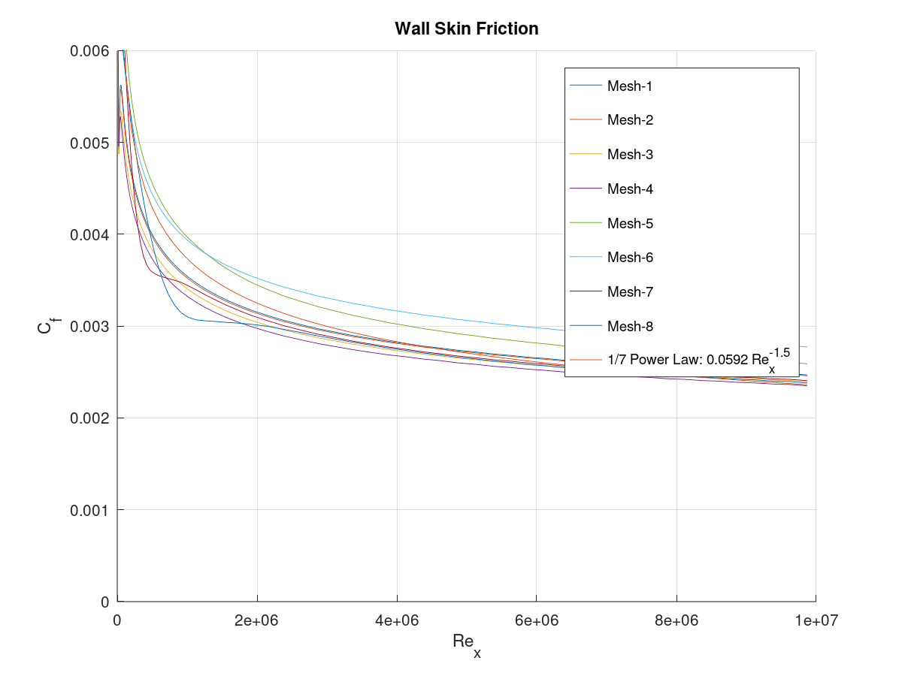
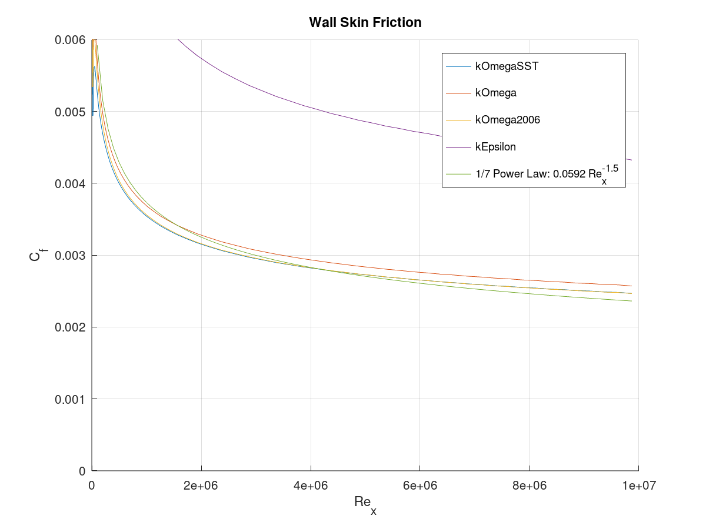

# Flat Plate

This is an OpenFOAM simulation for 2D turbulent flow over a flat plate. It is a computationally small problem that is well studied and has experimental data available for comparison, making it convenient for testing various turbulence modeling methods.

[OpenFOAM Version 11](https://openfoam.org/version/11/) was used.

[Octave](https://octave.org/) is also used for some data processing.

## Scenario Overview
This replicates verification cases from [Ansys [1]](https://www.ansys.com/content/dam/amp/2022/february/asset-creation/best-practices-campaign/Best%20Practice-Rans%20turbulence%20modeling%20in%20Ansys%20CFD.pdf) as well as [NASA's Turbulence Modeling Resource [2]](https://turbmodels.larc.nasa.gov/flatplate_val.html). There is also an [OpenCFD tutorial case available [3]](https://www.openfoam.com/documentation/guides/latest/doc/verification-validation-turbulent-flat-plate-zpg.html).

The 2D domain is 2.0 m long and 1.0 m high. All measurements are taken at a plate length of 1.0 m (e.g. mid point of domain).


**Boundary Conditions:**

| Parameter | Inlet | Outlet  | Roof | Plate |
|-|-|-|-|-|
| *P* | Zero Gradient | 0 [Pa] | Symmetry | Zero Gradient |
| *U* | 1.0 m/s | Zero Gradient | Symmetry | No Slip |
| *k* | Fixed Value | Zero Gradient | Symmetry | `kqRWallFunction` |
| *nut* | Calculated | Calculated| Symmetry | `nutUSpaldingWallFunction` |
| *omega* | Fixed Value | Zero Gradient | Symmetry | `omegaWallFunction` |
| *epsilon* | Fixed Value | Zero Gradient | Symmetry | `epsilonWallFunction` |

**Turbulence Properties:**
* Turbulence Intensity: 1.0 %
* Turbulent Viscosity Ratio: 0.20

**Mesh:**
* Cells: 16,214
* First cell size: 1.0e-6 x 5.0e-7 m
* Far field cell size: 0.05 x 0.05 m

## Usage
The file `include/initialConditions` contains all settings for the simulation: duration, time step, Re, domain size, plate length, turbulence model, etc.

There are a set of scripts under the `scripts` directory for running everything. Run any script with the `-h` option for usage. Many scripts accept a `-c` option to clear existing data prior to running.

To mesh:
```bash
./scripts/mesh.sh
```

To solve:
```bash
./scripts/solve.sh
```

To mesh and solve together:
```bash
./scripts/run_all.sh
```

To clean all artifacts (`-m` and `-s` clean mesh and solution data, respectively):
```bash
./scripts/clean.sh -ms
```

### Post Processing
There are post processing functions active that will:
* Compute y+ values
* Compute wall shear stress
* Sample velocity along the Y axis at `x=plate_L`
* Sample wall shear stress at each cell along wall

### Saving Results
Running the following will save a copy of mesh and solver logs, initial conditions, settings, post processing data, and plots of skin friction and velocity profile. The example saves for a specific time point of `3000` seconds, remove to just save the lates time point.
```bash
./scripts/save_results.sh results/my_test -t 3000
```

### Plotting
There is an `octave` script for plotting skin friction and near wall velocity profiles (u+ vs. y+). It can accept multiple data inputs and has options for specifying plot limits (run with `-h` to see options).
```bash
octave scripts/plot_results.m -i my-test postProcessing/wall_shear_sample/3000/plate.xy postProcessing/U_profile_sample/3000/x1_0.xy include/initialConditions -Cf_lim 0.0 0.006 -y_plus_lim 1e-1 1e4
```

Alternatively, if results have been saved with the `save_results.sh` script then one can use the following script to plot the saved data. This can accept multiple data inputs as well. Run with `-h` to see options.
```bash
./scripts/plot_saved_results.sh -d results/my_test -n my-test
```

### Running Experiment Permutations
There is a script to run simulations for many different scenarios and save the results for each. Before each run it will edit the `include/initialConditions` file (a backup will be saved) to alter some parameter, run the simulation, then save the results before moving onto the next permutation. Once all permutations are run a plot of all results together will be generated.

```bash
./scripts/evaluate_permutations.sh -p experimentsturbulence_models.txt -o results/turbulence_model_variations
```

This will load a file `experimentsturbulence_models.txt` that has the form:
```
param_name,new_value,results_name
```
Where `param_name` is the name of the variable in `include/initialConditions` to modify, `new_value` is the new parameter value to set, and `results_name` is name used for saving and plotting data.

Some example permutation files are included under the `experiments` directory.

## Mesh Settings
The `blockMesh` utility is used for mesh generation. It is configured to use cell grading along some portion of the X and Y directions starting at the plate and the leading edge, beyond which cells will have uniform sizing. The expansion ratio is computed based on an expansion range along with an initial and final cell size.

All mesh settings for cell and domain sizing are in the `include/initialConditions` file.

## Results
### Mesh Sensitivity
The simulation was run with the `kOmegaSST` turbulence model while varying cell thicknesses adjacent to the plate to alter the y+ value.

Eight meshes sizes were evaluated which cover the full range of y+ values throughout the viscous sub-layer, the transition layer, and the inertial sub-layer.

| Mesh | Cell Thickness [m] | y+ Min | y+ Max | y+ Mean |
|-|-|-|-|-|
| 1 | 5.0e-7 | 0.044 | 0.138 | 0.054 |
| 2 | 1.0e-6 | 0.087 | 0.276 | 0.108 |
| 3 | 5.0e-6 | 0.430 | 1.374 | 0.529 |
| 4 | 1.0e-5 | 0.855 | 2.750 | 1.053 |
| 5 | 5.0e-5 | 4.474 | 11.903| 5.801 |
| 6 | 1.0e-4 | 9.176 | 20.326 | 11.412 |
| 7 | 5.0e-4 | 42.559 | 76.946 | 52.985 |
| 8 | 1.0e-3 | 85.935 | 141.955 | 106.316 |

<p align="center">
    
</p>

<p align="center">
    
</p>

To run this experiment:
```bash
./scripts/evaluate_permutations.sh -p experiments/meshes.txt -o results/meshes
```

### Turbulence Model Comparison
A selection of turbulence models were run against the finest and coarsest meshes from the experiment above, #1 and #8.

Results from mesh #1:
<p align="center">
    
</p>

<p align="center">
    
</p>

Results from mesh #8
<p align="center">
    
</p>

<p align="center">
    
</p>

To run this experiment:
```bash
./scripts/evaluate_permutations.sh -p experiments/turbulence_models.txt -o results/turb_models
```

## References
[1] [*Best Practice: RANS Turbulence Modeling in Ansys CFD - Version 1.0* - F. R. Menter, R. Sechner, A. Matyushenko](https://www.ansys.com/content/dam/amp/2022/february/asset-creation/best-practices-campaign/Best%20Practice-Rans%20turbulence%20modeling%20in%20Ansys%20CFD.pdf)  
[2] [*2D Zero Pressure Gradient Flat Plate Validation Case* - NASA Turbulence Modeling Resource](https://turbmodels.larc.nasa.gov/flatplate_val.html)  
[3] [*OpenCFD  OpenFOAM v2112 Tutorial: Turbulent flat plate*](https://www.openfoam.com/documentation/guides/latest/doc/verification-validation-turbulent-flat-plate-zpg.html)
