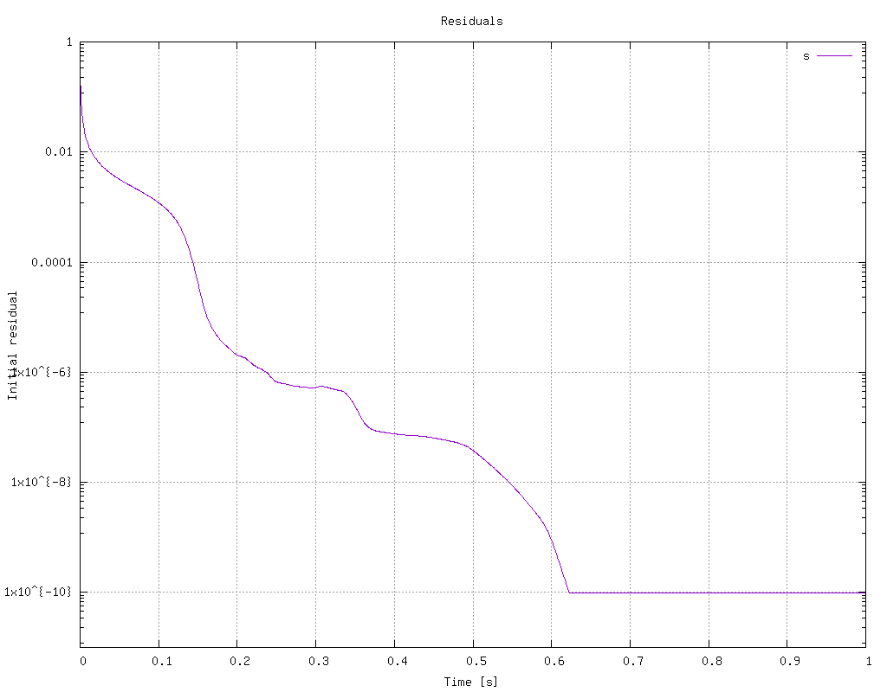
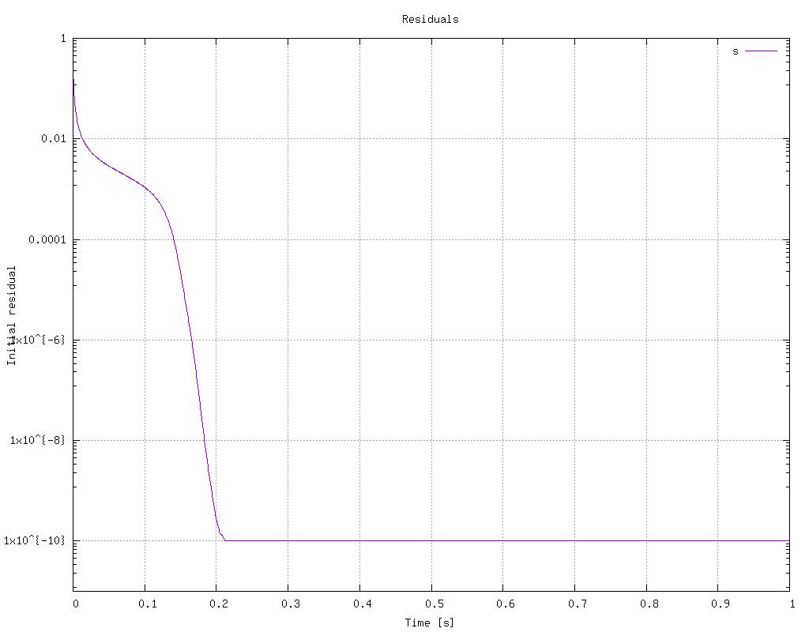

# Oblique Numerical Diffusion

An analysis of numerical diffusion caused by different interpolation schemes.

[OpenFOAM Version 11](https://openfoam.org/version/11/) was used.

[Octave](https://octave.org/) is also used for some data processing.

## Experiment Setup
The simulation is constructed to isolate the impact of just a single numerical technique: interpolation methods.

The simulation solves a scalar transport equation:

<p align="center">
    
</p>

In this experiment the diffusion coefficient is set to zero and there are no source terms, so besides the time component there only the convection term remains.

The divergence theorem relates the divergence of a vector field to the net fluxes into and out of that region, which is approximated by a combination of cell surface areas and cell face values. Thus, computing the divergence depends on an interpolation scheme, of which there are many.

The domain is a square region with 50x50 quad cells and a velocity field at 45 degrees to the cell normals. The scalar boundary conditions are 1.0 along the X=0 boundary, and 0.0 everywhere else.

<p align="center">
    
</p>

With the velocity field being at a 45 degree angle to the domain we will see the scalar progress along the domain diagonal. Depending on the numerical properties of the interpolation method we will see varying amounds of numerical diffusion along the diagonal.

**Scheme:** `upwind`  
<p align="center">
    
</p>

**Scheme:** `limitedLinear 0.2`  
<p align="center">
    
</p>

Points are sampled along a line connecting the top left and bottom right corners (i.e. [0, y_max] --> [x_max, 0]). The exact solution for the scalar value will be a step change, but the actual gradient scheme will differ.

<p align="center">
    
</p>

## Usage
There are a set of scripts under the `scripts` directory for running everything. Run any script with the `-h` option for usage. Many scripts accept a `-c` option to clear existing data prior to running.

To mesh:
```bash
./scripts/mesh.sh
```

To solve:
```bash
./scripts/solve.sh
```

To clean all artifacts (`-m` and `-s` clean mesh and solutio data, respectively):
```bash
./scripts/clean.sh -ms
```

The dictionary `include/initialConditions` controls everything for the simulation:
* divSchemes entry for `div(phi,s)`
* Grid size
* Courant number
* Flow angle
* Time step size and duration

Edit values in the `initialConditions` file to alter the simulation and re run.

### Plotting
There is an `octave` script to plot the samples from the line sampling postProcessing operation:
```bash
octave scripts/plot_scalar_diffusion.m -i path/to/samples.csv
```

You can specify Y axis limits with the `-y` option, or save the figure with the `-s` option. Run with `-h` for usage details.

There is also a bash script to run the plotting script for all CSV files within a directory and plot all data on the same figure:
```bash
./scripts/plot_all_results -d path/to/my/results
```

The result can be saved with the `-s` option.

### Evaluating Permutations
A batch of simulations can be run that will vary any parameter in the `include/initialConditions` file:
```bash
./scripts/evaluate_permutations.sh -f "div(phi,s)" -p experiments/schemes.txt -xs -o results/schemes
```

This will modify the value of `div(phi,s)` and re run the simulation for every value contained in the file `experiments/schemes.txt`. All results will be saved in the directory `results/schemes`.

The `-s` argument saves the following artifacts:
* Solver log
* Plot of scalar value from line sample points
* Plot of solver residual
* ParaView screenshot at last time point

The `experiments` directory contains a few permutations for some parameters.

## Scheme Comparison
The simulation was run for a variety of interpolation schemes using the following settings:
* Grid Size: 50x50
* Co Number: 0.25
* Time Steps: 0.0005 s step size, 1.0 s duration
* Solver: PBiCG, with DILU preconditioner

Recorded execution times are only from a single run of the simulation.

The rendered view of the scalar field makes it immediately obvious how schemes differ in both the numberical diffusion across the step change, and how the magnitude of that diffusion grows as the flow progresses downstream.

| Scheme | Type | Execution Time [s] | Line Samples | Field | Residual |
|-|-|-|-|-|-|
| linear | Centred, 2nd order, unbounded  | 1.1744 |  |  |  |
| SFCD | Centred, 2nd order, bounded | 0.963906 |  |  |  |
| upwind | Upwind, 1st order, bounded | 0.707138 |  |  |  |
| linearUpwind | Upwind, 2nd order, unbounded | 1.05093 |  |  |  |
| QUICK | Upwind, 2nd order, unbounded | 1.13859 |  |  |  |
| UMIST | Upwind, 2nd order, unbounded | 0.979256 |  |  |  |
| LUST | Blended, 2nd order, unbounded | 1.12586 |  |  |  |
| limitedLinear 0.2 | TVD, 1st/2nd order, unbounded | 1.36465 |  |  |  |
| limitedLinear 1.0 | TVD, 1st/2nd order, unbounded | 0.988195 |  |  |  |
| Minmod | TVD, 1st order, unbounded | 1.04678 |  |  |  |
| MUSCL | TVD, 2nd order, unbounded | 0.997513 |  |  |  |
| SuperBee | TVD, 2nd order, unbounded | 1.16961 |  |  |  |
| vanLeer | TVD, 2nd order, unbounded | 1.03033 |  |  |  |


## Grid Sensitivity
Another experiment was run using different grid sizes, with each successive grid doubling the number of cells in each direction. The different orders of accuracy between schemes will be apparent in the rate which the error reduces as a function of grid size.

The following cell sizes were evaluated:
* 25x25
* 50x50
* 100x100
* 200x200

The following settings were constant across all runs:
* Co Number: 0.25
* Time Steps: 0.0005 s step size, 1.0 s duration
* Solver: PBiCG, with DILU preconditioner

**upwind:**  
The `upwind` scheme is a 1st order scheme and you can clearly see a consistent reduction in error as the grid is refined.
<p align="center">
    
</p>

**QUICK:**  
Alternatively, `QUICK` is a 2nd order scheme and you can see the magnitude of the error reduction decreases quadratically as the grid is refined.
<p align="center">
    
</p>

## Co Number Sensitivity
To see how robust different schemes were another experiment was run with varying Courant numbers.

The following Courant numbers were evaluated:
* 0.125
* 0.25
* 0.50
* 1.0
* 2.0
* 4.0
* 8.0

The following settings were constant across all runs:
* Grid Size: 50x50
* Time Steps: 0.0005 s step size, 1.0 s duration
* Solver: PBiCG, with DILU preconditioner

Not all simulations completed successfully at higher Co numbers. Any plots below with Co entries missing are due to the residuals exploding and the simulation crashing.

Only a select few schemes are shown here that produced interesting results. Most other TVD schemes behaved similarly to the `SuperBee` scheme.

**linear:**  
The `linear` scheme is the most oscillatory scheme evaluated, and both the amplitude and dissipation rate of the oscillations is influenced by the Co number. Low Co numbers have the larges oscillations near the step change, but this oscillation dissipates the most quickly. Conversely, at large Co numbers the magnitude of the oscillation is smaller but they do not dissipate nearly as quickly.

At Co=4 the oscillations persisted across most of the domain. At Co=8 the simulation did not converge.

<p align="center">
    
</p>

**upwind:**  
Since the `upwind` scheme is simply copying values from the upstream direction it is not dependent on gradients, and thus not affected by the Co number. Hence, all Co numbers produced the same result. That stability however comes at the expense of consistently large numerical diffusion.

<p align="center">
    
</p>

**limitedLinear 0.2:**  
For the `limitedLinear` scheme with a coefficient of 0.2 the behaviour was nearly identical for Co numbers 0.125, 0.25, and 0.5. Only at a Co of 1.0 was there an increase in numerical diffusion. At a Co of 4.0 there starts to be some overshoot and oscillatory behaviour. At 8.0 the simulation failed to converge.

<p align="center">
    
</p>

**SuperBee:**  
The `SuperBee` scheme was largely independent of Co while Co<1, but as soon as Co approached 1.0 it became very obviously unstable.

<p align="center">
    
</p>

## Takeaways
* `upwind` is the most diffusive, followed by `SFCD`, then `Minmod`
* The following schemes are oscillatory, in order front most severe to least severe:
   * `linear`
   * `linearUpwind`
   * `QUICK`
   * `LUST`
* `linear` and `limitedLinear 0.2` take the longest to converge, followed by `QUICK`, while all other schemes take a similar amount of time
